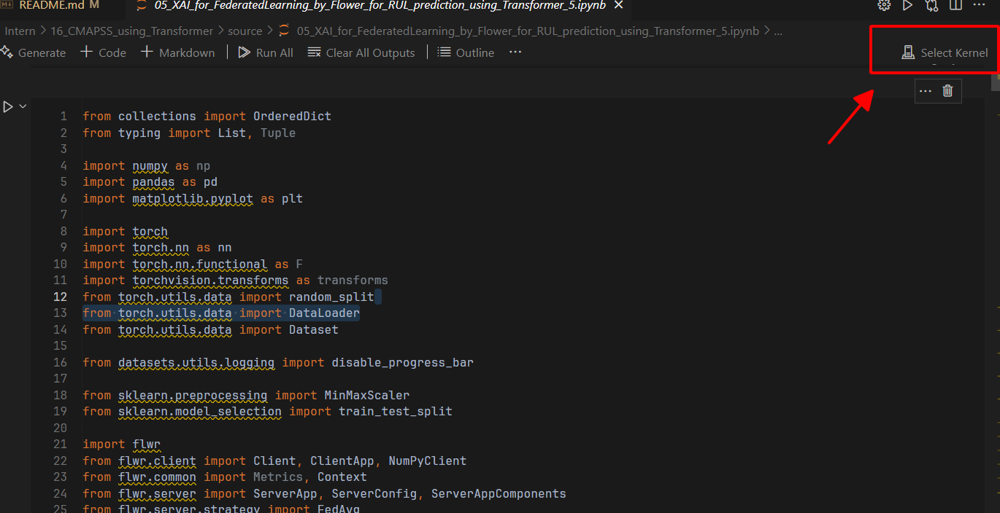
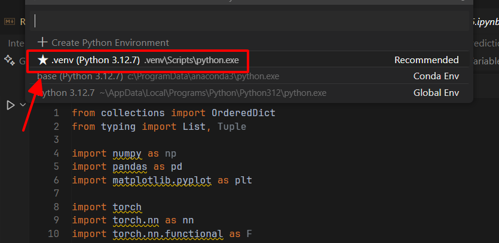
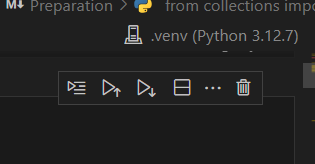

# CMAPSS RUL Prediction with Transformers: A Federated Learning Approach via Flower (PyTorch)

- **The CMAPSS dataset** (Commercial Modular Aero-Propulsion System Simulation) is widely used in the field of predictive maintenance. It provides realistic simulation data for turbofan engine degradation, making it a benchmark for Remaining Useful Life (RUL) prediction. Accurate RUL predictions are crucial for reducing maintenance costs, avoiding unexpected failures, and optimizing asset management in industrial settings.
- **Remaining Useful Life (RUL) prediction** aims to estimate the time left before a system or component fails. By leveraging advanced machine learning techniques, such predictions help industries transition from reactive to predictive maintenance, ensuring operational efficiency and safety.
- **Federated Learning (FL)** offers a decentralized approach to model training, where data remains on local devices, and only model updates are shared. This is critical for industries that handle sensitive data but still require collaborative insights across different systems or locations. By preserving data privacy while enabling large-scale learning, FL provides a scalable and secure framework for predictive maintenance tasks.
- To address data privacy and scalability challenges, we integrate the **Flower (flwr) framework** to implement Federated Learning (FL). FL allows decentralized model training across multiple nodes without sharing raw data, ensuring data security while benefiting from collaborative learning. This combination of Transformers and FL creates a robust, privacy-preserving solution for industrial-scale RUL prediction.

# Simulation

### 1. Create a virtual enviroment

* Create .venv
  Sau khi download code, vào thư mục dự án và tạo một môi trường ảo bằng lênh sau:
* ```
  python -m venv .venv

  ```
* Activate .venv
  Cần kích hoạt môi trường ảo trước khi cài đặt các gói phụ thuộc cần thiết để chạy chương trình. Kích hoạt môi trường ảo trong terminal (trong Visual Studio Code) như sau:

  ```
  .venv\Scripts\activate

  ```

  Sau khi kích hoạt môi trường ảo thành công thì cài đăt các gói phụ thuôc (Tại bước 2. Pip installation)
* Deactivate .venv

  Tắt kích hoạt môi trường ảo trong terminal bằng cách:

  ```
  deactivate

  ```

### 2. Pip installation

```
pip install -r Requirements.txt

```

### Lưu ý:

Trước khi chạy code dự án, cần chọn đúng môi trường ảo để chạy một cách đầy đủ và chính xác.

Ví dụ chạy file 05:

* Mở file đầu 05 lên:
* Chọn môi trường ảo (chọn đúng tên môi trường ảo đã cài lúc trên)

  
* 

  
* Nhấn Run all để chạy
